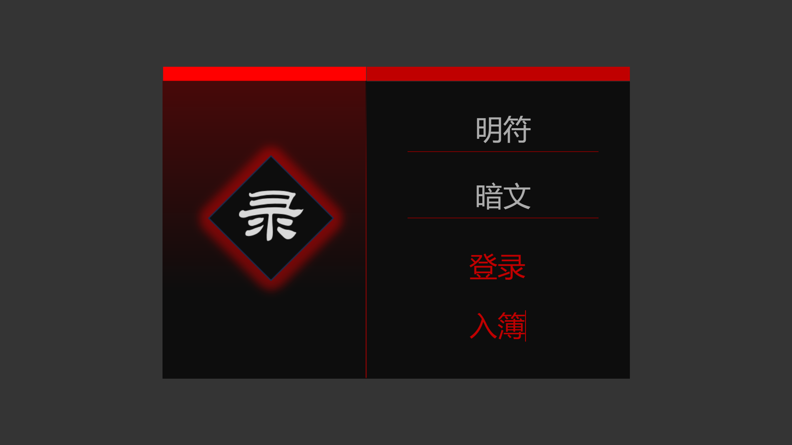
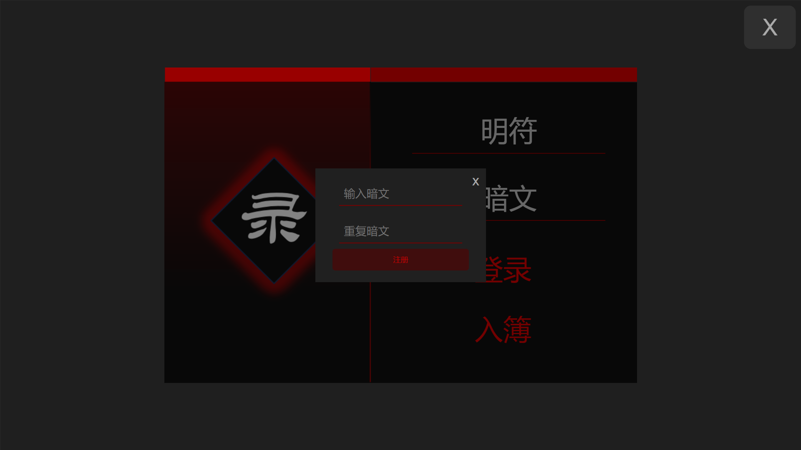
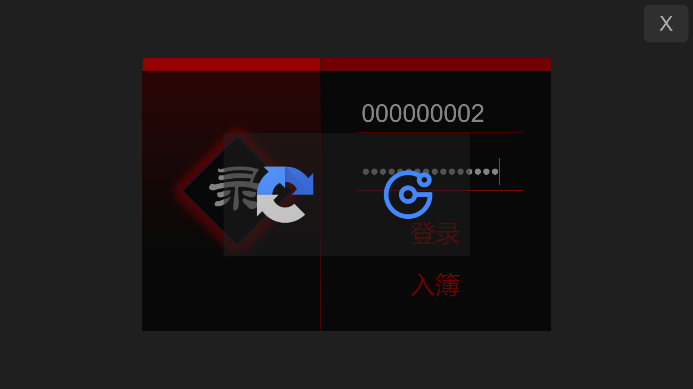
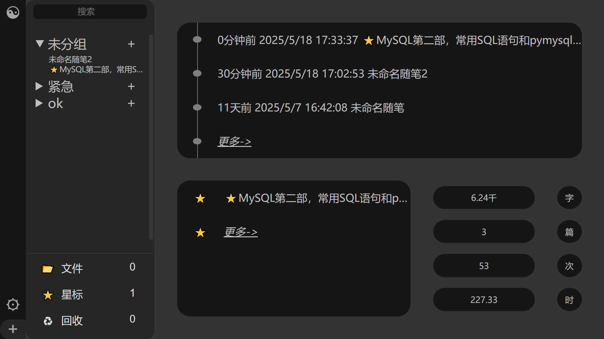
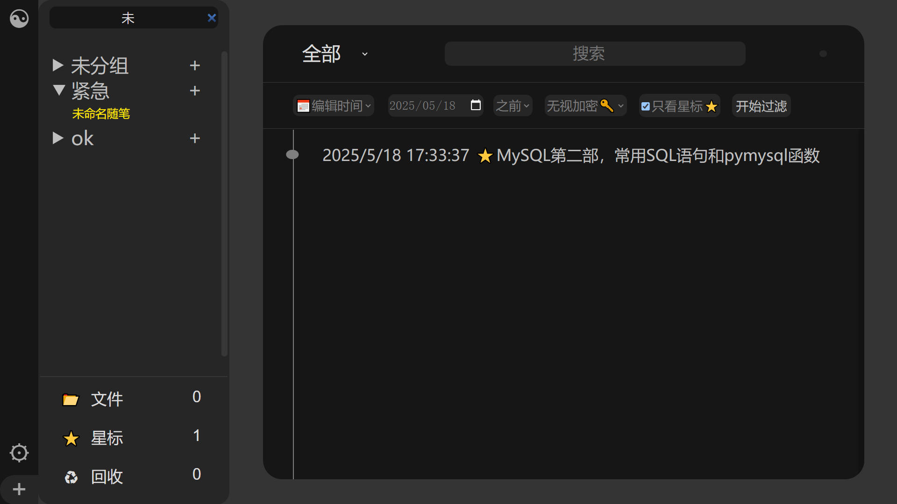
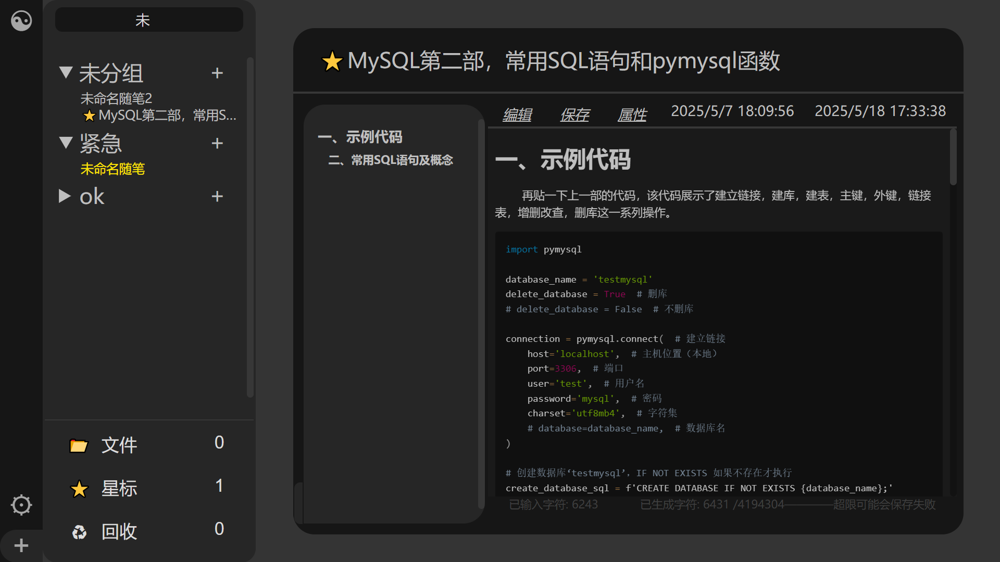
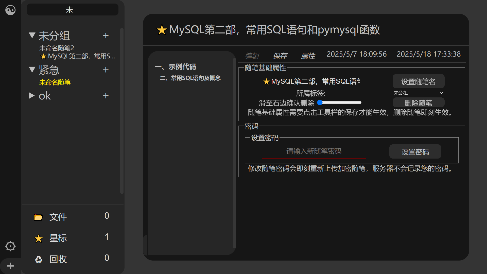
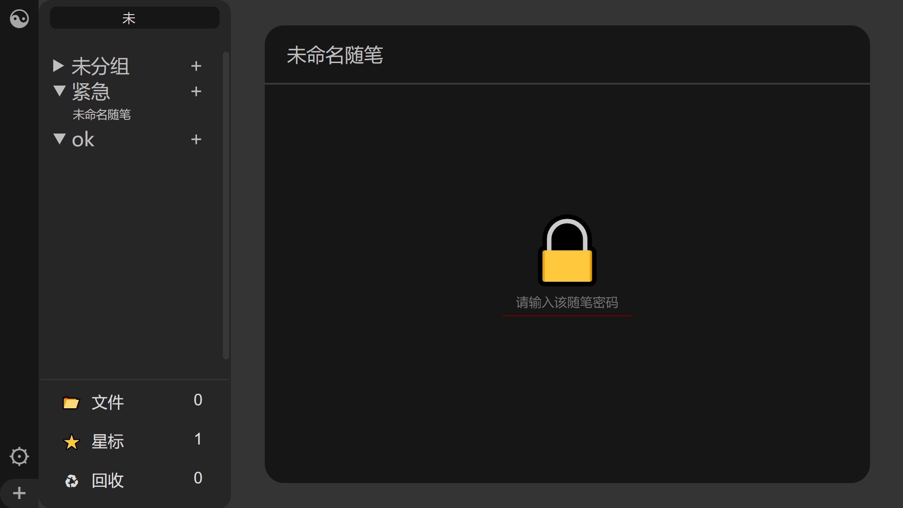
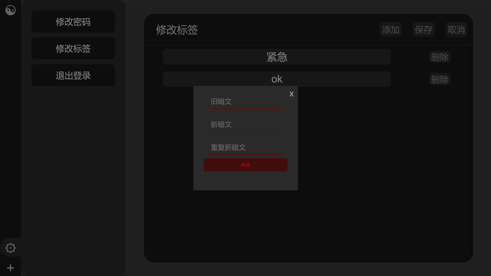

# idaoi_record
使用tomcat服务器\
src/main/java/dao/i道i_记录.sql  转储数据库\

# 登录

# 注册

# 人机验证选择
左边是谷歌，steam那种，右边是极验，bilibili那种\
如果你要用，需要去申请令牌，一个公钥一个私钥，\
放在下面两个地方，\
src/main/webapp/登录.jsp\
src/main/java/Verify_Get_Server_Token.java\
没有令牌情况下，点左边的就自动给你服务器令牌\

# 登陆进去的主页，左边侧边栏能开关

# 搜索页面

# 随笔显示页面
编辑器用的wangEditor\
左边的目录界面能跳转，左下角按钮开关目录\

每个随笔都可以独立设置密码，该密码服务器不保存，忘了就进不去了\
给随笔第一个字符用⭐就是星标，用♻就扔进回收站，默认不显示了。\

侧边栏设置按钮能修改密码和自定义分组\

代码有注释，自己看。
